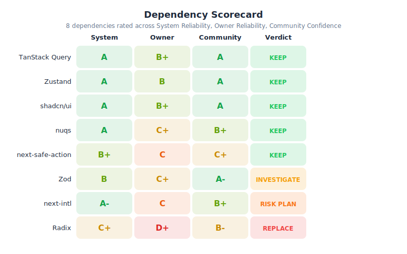
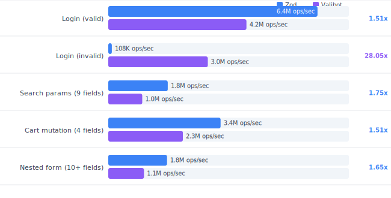
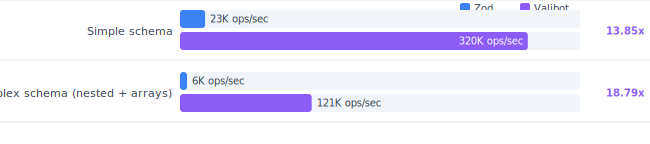
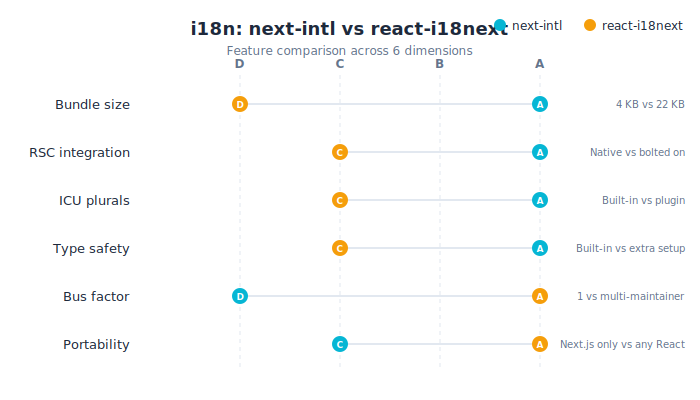
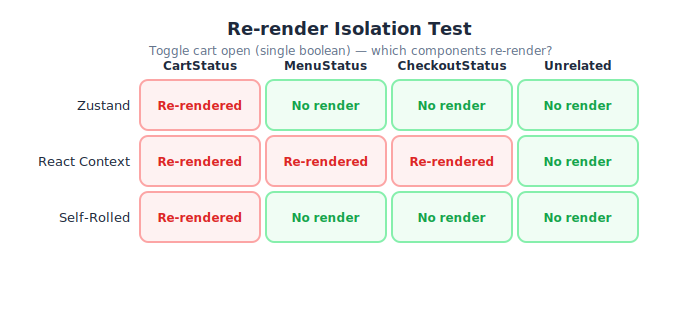
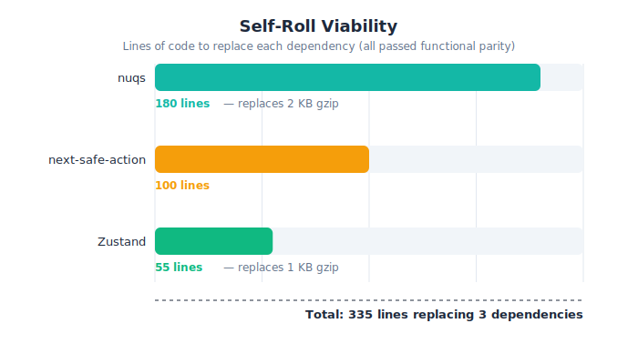

# I Asked Claude to "Show Me the Money" When It Suggested a List of Dependencies

## My Takeaways (100% Human Written)

<!-- TODO: Write your personal takeaways here. Some prompts to consider:
- What surprised you about the results?
- What did you learn about working with AI on technical analysis?
- Where did Claude get it right vs. where did you have to push back?
- What would you do differently next time?
- How did the council review change your thinking?
-->

*[Your takeaways here]*

---

## How This Article Was Made

I was planning a new Next.js site and Claude generated a design doc that included 8 frontend dependencies. Looking at the list, I had a question: did Claude actually evaluate these, or did it just pick whatever's popular? I'd been reading about dependency maintainers abandoning projects, merging them into other libraries, or dropping support -- and I wanted to know if what Claude suggested was actually defensible.

So I asked Claude to prove it. It built a scoring framework, a benchmark harness, and generated real numbers. Then I asked it to write up its findings as an article.

But I didn't just publish what it gave me. The draft went through a multi-step review:

1. **Claude wrote the initial analysis** -- the scoring framework, benchmarks, and recommendations below.
2. **I verified the harness** -- confirmed it builds, runs, and produces the claimed benchmark numbers.
3. **I ran it through an AI review council** -- three separate Claude instances with different analytical personas (a critical thinker, a stress-tester, and an inverse-signal detector) independently reviewed the article for fabricated claims, bad methodology, and misleading framing.
4. **I reviewed the council's findings** and pushed back where they were wrong (they flagged "Next.js 16" as fabricated -- it's not, it shipped). The valid critiques led to concrete fixes: the 28x error-path claim now leads with the caveat that it compares different error-handling modes, the bundle size comparison now honestly notes `@zod/mini` as the real comparator, line counts were reconciled across the article and code, and the Radix/shadcn contradiction is called out directly.

What follows is Claude's analysis with those corrections applied. The thinking is Claude's. The verification is mine.

For context, the original design doc that started this: [Architecture Overview](architecture-overview.md). That's where the dependency list came from.

---

## Why Not Just Pick the Popular Stack?

Every dependency is a bet. You're betting that the maintainers will keep shipping, that the API won't churn, and that when something breaks at 2am, someone other than you will care. Download counts don't tell you any of that. A library with 40M weekly downloads can have a bus factor of 1.

I needed a framework that separated hype from signal.

---

## The Scoring Framework

I scored every dependency on three dimensions, using a letter-grade scale (A through D) based on weighted inputs for each category. The grades are qualitative but structured -- each one maps to specific observable signals, not gut feel:

**System Reliability** -- Stability, breaking change history, release quality, bundle size. Inputs: version history, migration guides, GitHub issue quality.

**Owner Reliability** -- Bus factor, funding model, governance. Inputs: maintainer count, corporate backing, track record across major version transitions.

**Community Confidence** -- Production adoption, not raw popularity. Inputs: dependent count (packages that actually import it), named companies running it in production, survey retention data, migration direction (are teams moving toward or away from it?).

The key insight: I used **dependent count** rather than download count as the primary community signal. Dependents represent real codebases that break if the library breaks. Downloads include CI pipelines, bots, and transitive installs. For reference: TanStack Query has ~7,500 dependents, Zustand ~5,600, Zod ~14,000, while next-intl has ~450 and next-safe-action ~120. The gap between "popular" and "load-bearing infrastructure" shows up here, not in download stats.

### The Scorecard



Two findings stood out.

**Radix scored lowest on Owner Reliability.** Co-creator Pedro Duarte publicly expressed concerns about the project's direction before departing. Key team members followed. Long-standing accessibility bugs remain unfixed. Several original creators moved to MUI and worked on Base UI. For a new project starting fresh, Base UI is a viable alternative -- though note that shadcn/ui components still depend on Radix primitives under the hood. This creates a practical contradiction: you can't KEEP shadcn/ui and REPLACE Radix today. Teams using shadcn/ui are coupled to Radix until shadcn officially supports alternative primitive layers.

**next-intl flagged as highest overall risk** despite scoring A- on System Reliability. Best-in-class DX, native RSC support, 4KB bundle (with precompilation enabled -- 13KB without). But a single maintainer sits on the critical path for internationalization across 30+ countries, and migration would take 2-4 weeks. High quality + deep coupling + single-point-of-failure ownership = risk.

---

## The Benchmark Harness: How It Works

Scorecards tell you about the project. Benchmarks tell you about the code. I needed both.

I built a **Next.js 16 app with 11 test routes** covering 5 comparison areas. Each route implements a real-world use case -- not a toy counter app, but login forms, search filters, cart mutations, and booking flows with nested validation.

```
benchmark-harness/
  app/
    i18n-test/
      next-intl/          -- next-intl with 7 locales
      react-i18next/      -- react-i18next (same content, same locales)
    validation/           -- Zod vs Valibot (side-by-side benchmark runner)
    url-state/
      nuqs/               -- nuqs library
      self-rolled/         -- ~200 lines, same API
    server-actions/
      safe-action/        -- next-safe-action library
      self-rolled/         -- ~83 lines, same result types
    ui-state/
      zustand/            -- Zustand store
      context/            -- React Context (baseline)
      self-rolled/         -- ~65 lines using useSyncExternalStore
  lib/
    schemas/
      zod-schemas.ts      -- 4 Zod schemas (login, search, cart, booking)
      valibot-schemas.ts  -- 4 identical Valibot schemas
      validation.bench.ts -- Vitest benchmark suite
    self-rolled/
      url-state.ts        -- Type-safe URL parsers + shallow routing
      safe-action.ts      -- Auth middleware + validation wrapper
      store.ts            -- useSyncExternalStore mini-store
```

The harness runs benchmarks two ways:

1. **Vitest bench mode** for statistically rigorous server-side performance measurement (1000+ iterations with warmup)
2. **Browser-based timing** using `performance.now()` across 10,000 iterations for interactive comparison

Bundle analysis runs via `@next/bundle-analyzer` with `ANALYZE=true`. Re-render isolation is tracked through React DevTools Profiler plus manual render counters embedded in each component.

The goal: every claim in the scorecard has a number behind it.

---

## What the Benchmarks Revealed

### Zod vs. Valibot: The Story Is More Nuanced Than "Which Is Faster"

The headline comparison -- happy-path validation speed with reused schemas -- goes to Zod by 1.5-1.75x.



But the numbers shift dramatically on two axes.

**Error path performance:** When input is invalid, Valibot is **28x faster** than Zod (3.03M vs 108K ops/sec) -- but this comparison requires a significant caveat. Zod collects all validation errors by default, while Valibot aborts at the first failure. These are fundamentally different error-handling modes: Zod returns every issue at once (better UX for forms), while Valibot returns only the first (faster, but users fix errors one at a time). The 28x margin reflects default configurations, not equivalent workloads, and would narrow substantially if both libraries were configured for the same error-collection behavior. That said, in form validation where users routinely submit bad data, the error path is the hot path regardless of which mode you choose.

**Schema creation speed:** Valibot is **14-19x faster** at one-shot schema creation. If schemas are defined inside components or request handlers (common in dynamic forms), this gap is real.



**Bundle size:** Valibot tree-shakes aggressively. Zod v4 improved bundler friendliness and introduced `@zod/mini` (3.9 KB gzip), but the core `zod` package still ships as a single unit.


Valibot drops to **1.37 KB gzip** for a login form. The honest comparison is against `@zod/mini` at 3.9 KB (a 2.8x difference), not full Zod at 17.7 KB. Based on these numbers, the decision: **Zod on the server** (ecosystem integration, reused schemas where it's fastest) and **Valibot on the client** (bundle size, error-path performance). Both support the Standard Schema spec, making them swappable at the server action layer without touching middleware. The trade-off: two validation libraries means two schema syntaxes and two error formats. In practice, the boundary is clean -- server actions use Zod, client components use Valibot, and Standard Schema handles the handoff -- but new team members will need to learn both.

---

### i18n: next-intl vs. react-i18next

next-intl wins on technical merit across most measurable dimensions -- but loses on the two that matter most for organizational risk.



The trade: smaller bundle, better DX, and native RSC support vs. organizational resilience. For a site serving 30+ countries, organizational resilience matters. next-intl stays, but with a documented exit plan to react-i18next and quarterly health checks on the repo.

---

### State Management: Re-render Isolation

The test: toggle the cart open (a single boolean change). Which components re-render?



Zustand and the self-rolled store (65 lines using `useSyncExternalStore`) both isolate re-renders to the consuming component. React Context re-renders **every consumer** on any state change -- cart, menu, and checkout status all re-render when only the cart changed.

For 3 booleans and an enum, Context doesn't cause visible jank. But the pattern matters as state surfaces grow.

---

## The Self-Roll Question: ~349 Lines Replacing 3 Dependencies

Three of the eight dependencies could be replaced by small, focused implementations that passed functional parity tests. (Note: the safe-action replacement still depends on Zod for schema validation -- "self-rolled" here means the wrapper logic, not the validation layer.)



The line I drew: if the implementation is under ~200 lines, has minimal dependencies, and the library's main value is convenience rather than capability, self-rolling is a viable option. Why 200? At that size, the entire implementation fits in a single PR review, a single AI context window for maintenance, and a single afternoon to rewrite if needed. You trade community maintenance for total control -- though "zero supply chain risk" is an overstatement. You're trading one kind of risk (upstream churn, abandonment) for another (implementation bugs, missed upstream improvements). The bet is that the second kind is easier to manage at this scale.

I did **not** self-roll i18n (ICU parsing and plural rules for 30+ languages is infrastructure) or validation (TypeScript type inference from runtime schemas is deep metaprogramming). There is a clear boundary between utility code and domain expertise.

This trade favors small teams with full-stack ownership. In regulated environments with formal change control, the compliance overhead of custom code may outweigh the supply chain simplification.

For drift tracking on self-rolled code: quarterly review where an AI agent diffs vendored implementations against upstream changelogs. At 65-201 lines per module, the entire implementation fits in a single context window.

---

## The Decision Framework

The evaluation produced a four-point strategy spectrum for every dependency:

**1. Copy-paste (shadcn/ui model)** -- You own the code. The "library" is a starting point. Zero lock-in.

**2. Self-roll** -- Under ~200 lines, minimal deps, utility-level complexity. Total control. AI-assisted drift tracking handles maintenance.

**3. Keep with a risk plan** -- The library is the right choice, but you document the exit. Wrap the API in a project-level abstraction. Monitor repo health. Name the fallback.

**4. Replace** -- The library is declining and a better option exists.

Where a dependency falls on this spectrum comes from the data. System Reliability tells you whether to keep it. Owner Reliability tells you whether to trust it. Community Confidence tells you whether you'll be alone when something breaks. The benchmarks tell you whether the performance justifies the risk.

---

## How to Apply This

You don't need to build the same harness. But you can apply the same thinking:

1. **Score before you benchmark.** Scorecard first -- many dependencies can be evaluated or eliminated on project health alone, before writing a single line of test code.

2. **Benchmark what matters.** Don't test happy paths in isolation. Test error paths, schema creation, bundle size after tree-shaking, and re-render isolation. The hot path in form validation is invalid input, not valid input.

3. **Measure the self-roll option.** For any dependency under 200 lines of focused logic, prototype the replacement. You might be surprised how little you actually need from the library.

4. **Use dependent count, not download count.** Dependents are real codebases that break if the library breaks. Downloads are noise.

Build the scorecard. Run the benchmarks. Know your numbers.

---

_The benchmark harness, all CSV data files, and the scoring methodology are open source: [github.com/defaultdave/benchmark-harness-public](https://github.com/defaultdave/benchmark-harness-public). Live demo: [defaultdave.github.io/benchmark-harness-public](https://defaultdave.github.io/benchmark-harness-public)._

_This analysis was generated by Claude (Anthropic), reviewed by an AI council of three independent analyst personas, and verified by a human engineer. See [How This Article Was Made](#how-this-article-was-made) for the full process. Factual claims should be independently verified._
